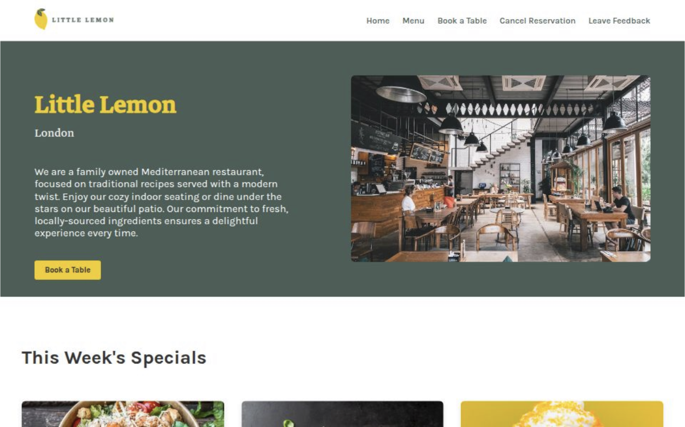

# Little Lemon :lemon:

Welcome to the Little Lemon Restaurant website repository. This project was created as a part of a capstone project for a front-end development course. It's built using React and offers a stylish interface for users who want to explore the restaurant's menu and make reservations.

## Live Preview

Check out the live version of the website! [View Live Demo](https://little-lemon-rust.vercel.app/)

## Features

- **Intuitive Navigation:** Seamlessly browse through different sections of the website.
- **Dynamic Menu Display:** Explore our diverse culinary offerings in an engaging way.
- **Effortless Reservations:** Book your table easily with our interactive reservation form.
- **Instant Booking Confirmation:** Get immediate confirmation for your table reservation.
- **Easy Contact Options:** Reach out to us quickly via the integrated contact form.
- **Modern Frontend:** Built with React for a responsive and dynamic user experience.

## Available Scripts

In the project directory, you can run:

### `npm install`
The npm install command is used to install all the dependencies defined in your project's package.json file. 

### `npm start`

Runs the app in development mode.\
Open [http://localhost:3000](http://localhost:3000) to view it in your browser.

The page will reload when you make changes.\
You may also see any lint errors in the console.

### `npm test`
Launches the test runner in the interactive watch mode.
It runs all the tests for the application and provides feedback on their status.

The test files are typically located in a directory named __tests__ or have a .test.js or .spec.js extension.

Make sure to write comprehensive tests to ensure the stability and correctness of the application.

### `npm run build`

Builds the app for production to the `build` folder.\
It correctly bundles React in production mode and optimizes the build for the best performance.

The build is minified and the filenames include the hashes.\
Your app is ready to be deployed!

See the section about [deployment](https://facebook.github.io/create-react-app/docs/deployment) for more information.
